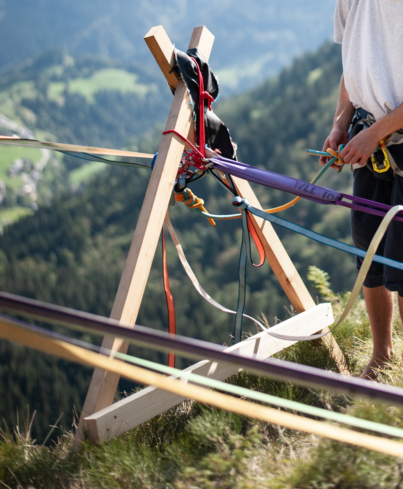

# A-okvir

_A-okvir_ je podporna struktura, s katero odmaknemo [skupno točko](skupna-tocka) [sidrišča](sidrisce) od tal, da preprečimo [abrazijo](abrazija) ter olajšamo dostop do izhodišča [visokice](visokica). Uporabimo ga, kadar so sidriščne točke bodisi precej odmaknjene od krajišča [visokice](visokica) bodisi se nahajajo zelo blizu tal (ali celo na tleh). A-okvir je najpogosteje izdelan iz treh lesenih tramov, zbitih v obliko črke A – od tod tudi njegovo ime. Pokončni stranici stojita na tleh, prečna povezava pa drži celo strukturo trdno. Skupna točka sidrišča je nameščena v prostor med njimi, podpira jo statična vrv, napeljana preko vrha ter stranic okvirja.

