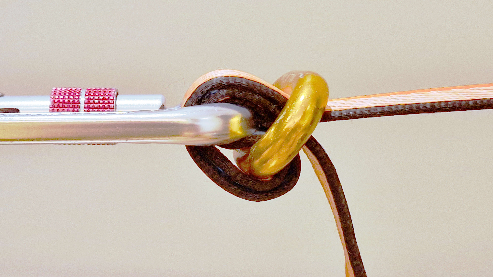

# Figa

_Figa_ je preprosto vpetje [traku](trak), ki ga naredimo tako, da trak na specifičen način speljemo skozi dva kovinska elementa – tipično člen verige ter vponko. Uporabljamo jo za izdelavo pritrdišča na poljubnem mestu na traku. Figa je sestavni del primitivnega [napenjalnega sistema](napenjalni-sistem), na [visokicah](visokica) pa pogosto služi za pritrjevanje [pomožnega traku](pomozni-trak) v [sidrišče](sidrisce).

## Izdelava

Osnovno izvedenko fige izdelamo s členom verige ter [vponko](vponka). Člen verige mora biti ravno dovolj širok, da skozenj lahko speljemo trak. Trak preganemo, vrh pregiba vstavimo skozi člen verige, ga ovijemo okoli ene stranice člena in naposled še enkrat prevlečemo skozi člen. Skozi vrh pregiba nato vtaknemo vponko: ta služi hkrati kot sestavni del fige ter kot pritrdišče. Obremenjeni pramen traku mora potekati po zunanji strani fige.

Ker je figa zelo preprost element, si lahko v varnostno nezahtevnih okoliščinah pri njeni izdelavi dovolimo znatno mero improvizacije. V praksi je tako figo mogoče izdelati iz kombinacije dveh skoraj poljubnih členov – na primer vponk, škopcev, obročkov in podobno.

## Uporaba

Figa služi podobnemu namenu kot [banana](banana): z njo lahko fiksno vpnemo poljubno mesto na traku. Glavna funkcionalna razlika med njima je, da banana dopušča drsenje traku v eni smeri, figa pa v nobeni: ko jo enkrat napravimo, traku skoznjo ne moremo več povleči. Zaradi tega njenega položaja na traku ne moremo preprosto prilagoditi. Čeprav je figo s previdnim vlečenjem pramenov v pravem zaporedju tehnično gledano sicer mogoče prestaviti brez podiranja, izkušnje kažejo, da si prihranimo znatno količino časa, truda in preklinjanja, če jo namesto tega raje kar takoj razdremo in napravimo nazaj na drugem mestu.

Figa je v splošnem manj univerzalen pripomoček od banane. Glavni razlogi za to so:

- Pri [napenjanju](napenjanje) traku s škripčevjem ne moremo razbremenjenega repa traku preprosto povleči skoznjo.
- Ne moremo je uporabiti kot del Buckinghamovega [napenjalnega sistema](napenjalni-sistem).
- Krivina, po kateri poteka trak v figi, je običajno agresivnejša od tiste v banani, zato figa ohranja manjši delež [minimalne porušne sile](minimalna-porusna-sila) traku. Tej težavi se lahko ognemo z uporabo namenskih členov (npr. MightyLock).

Kadar te omejitve niso bistvene, je figa lahko dobra alternativa banani, saj je v primerjavi z njo precej preprostejša, manjša, lažja in cenejša. Na visokicah jo tako pogosto uporabljamo za vpetje pomožnega traku v sidrišče.
