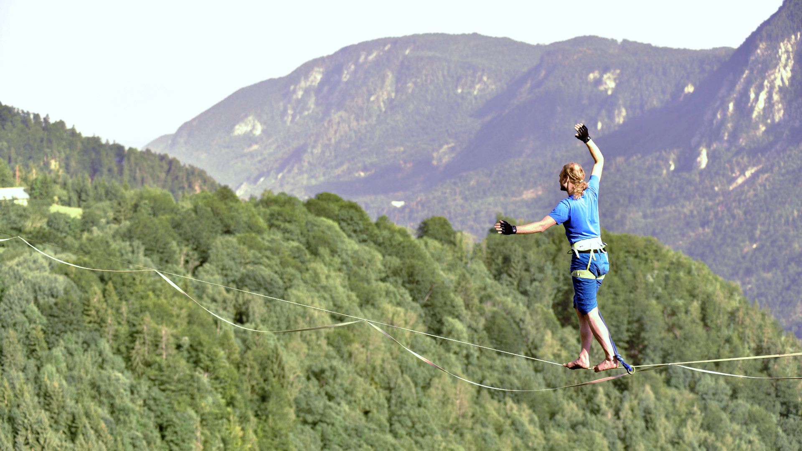

# Visokovalski priročnik

Poslanstvo tega priročnika je nudenje informacij, povezanih z [visokicami](visokica) (_highline_) in visokovanjem, v slovenskem jeziku in za slovenski prostor. Vsebino urejajo člani slovenske visokovalske skupnosti.

## Kaj je visokovanje?

Visokovanje ena od različic hoje po napetem traku ([slackline](slackline)), pri kateri je trak postavljen na veliki višini – od vsaj nekaj deset metrov nad tlemi, pa tudi do več sto. Takšna postavitev omogoča povsem svojevrstno izkušnjo, a obenem zahteva posebno opremo, znanje ter pristope, ki zagotavljajo, da je podvig tudi varen.

## Za začetnike in začetnice

**POMEMBNO:** Če te zanima visokovanje, se tega nikakor ne lotevaj sam, saj je vsaka napaka lahko usodna! Visokovanje je sicer precej varen šport, a le, kadar je oprema postavljena in preverjena s strani izkušenih visokovalcev. Predlagamo, se o visokovanju najprej poučiš s pomočjo tega priročnika in drugih [spletnih virov](spletni-viri), nato pa se pridružiš kaki izmed [visokovalskih skupin](skupnost). Za obširnejše informacije si oglej stran [za začetnike](/za-zacetnike/).

## Izrazje

V priročniku se trudimo uporabljati slovenske izraze, četudi to pomeni, da jih moramo na novo izumiti. Visokovanje je dokaj nov šport, zato mnoge zanj specifične besede še nimajo slovenskih ustreznic. Prevodi tujih izrazov v slovenski jezik so zbrani v [slovarju](slovar).
