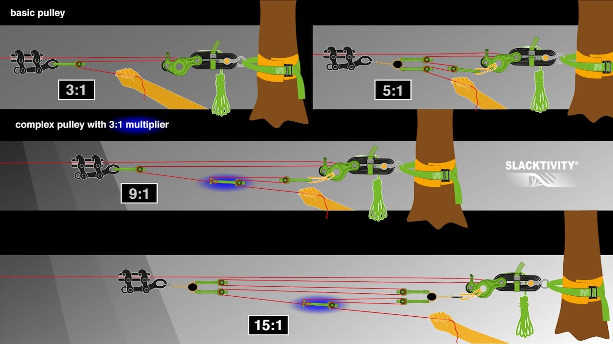
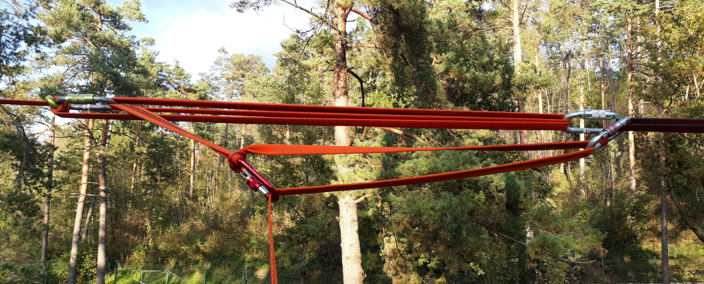

# Napenjalni sistem

_Napenjalni sistem_ je skupek komponent, s katerim [napenjamo](napenjanje) [trak](trak). Vsem je skupno, da z njimi ustvarimo [mehansko prednost](mehanska-prednost). Poznamo več osnovnih sistemov:

## Buckinghamov sistem

Je največkrat uporabljen pri napenjanju visokic. Zanj potrebujemo le malo komponent: za osnoven sistem z mehansko prednostjo 3:1 sta potrebna le [primež](primez) in [maček](macek), kot del napenjalnega sistema pa deluje tudi [banana](banana), ki po koncu napenjanja ostane na svojem mestu. Pri večini visokic že samo s takim sistemom dosežemo dovoljšnjo [napetost](napetost) za hojo. Višje sile je moč doseči tako, da trak povleče več ljudi; če to ne zadostuje, pa dodajamo [množilnike](mnozilnik).

## Primitivni sistem

Je enostaven sistem, največkrat uporabljan pri napenjanju krajših trakov v parku (njegova uporaba je smiselna do dolžine približno 30 m). Zanj potrebujemo več [vponk](vponka) ter manjši kovinski element, kot je na primer člen verige ali obroč. Primitivni napenjalni sistem ustvarimo tako, da najprej naredimo [figo](figa), nato pa trak peljemo v več ovojih skozi vponki na figi ter [sidrišču](sidrisce), pri čemer vsak nov ovoj postavimo pod prejšnjega. S takšnim ovijanjem dosežemo pomnožitev sile, hkrati pa ustvarimo zadostno trenje, da se trak, ko ga enkrat napnemo, ne more odviti sam od sebe. Tudi tu je za večjo mehansko prednost moč dodati množilnike, ki jih izdelamo z dodatnimi vponkami.

## Škripčevje

Je bolj kompleksen sistem, sestavljen iz več [škripcev](skripec), vrvi in zavore. Uporablja se za napenjanje dolgih linij oziroma linij, ki potrebujejo višje [napetosti](napetost).

