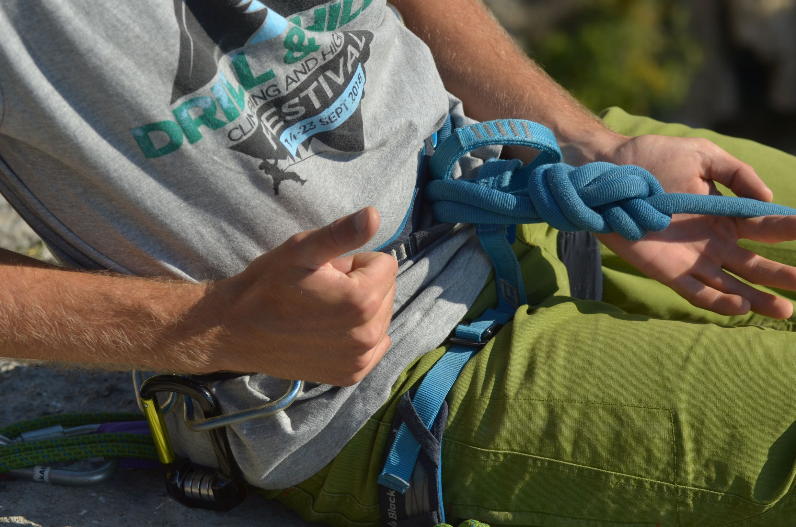

# Osmica

_Osmica_ je vozel s široko uporabo. V visokovanju ga uporabljamo pri izdelavi sidrišč ter za privezovanje na [vis](vis). Prednost vozla je, da ga je razmeroma enostavno zavezati ter pregledati, ne more se prevreči in tudi ne sam od sebe razvezati.

Za privezovanje na [vis](vis) uporabljamo vpleteno različico: na neprivezanem visu naredimo osmico, prosti konec visa prevlečemo skozi obe glavni zanki na pasu, nato pa z njim sledimo nazaj po poprej zavezani osmici. Ko zaključimo, mora biti vozel sestavljen iz petih parov vzporednih pramenov vrvi. Osmica ne potrebuje varovalnega vozla, ga pa včasih vseeno zavežemo, da porabimo preostanek visa, ki bi sicer pri padcih opletal naokoli. Alternativa varovalnemu vozlu je _Yosemitski zaključek_, pri katerem prosti konec speljemo okoli nosilnega pramena visa ter nazaj skozi vozel.

[Osmica v alpiročniku](https://alpirocnik.rasica.org/wiki/Vrvi,_vozli_in_njihova_uporaba#Osmica.C2.A0)

