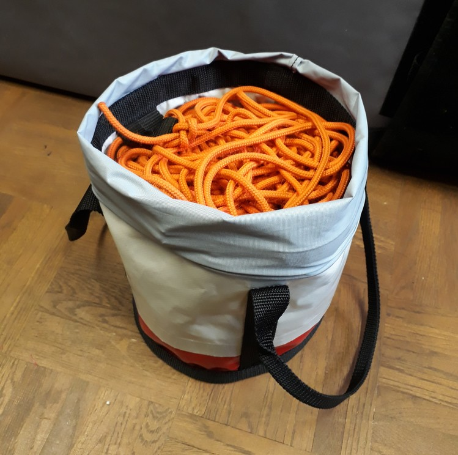
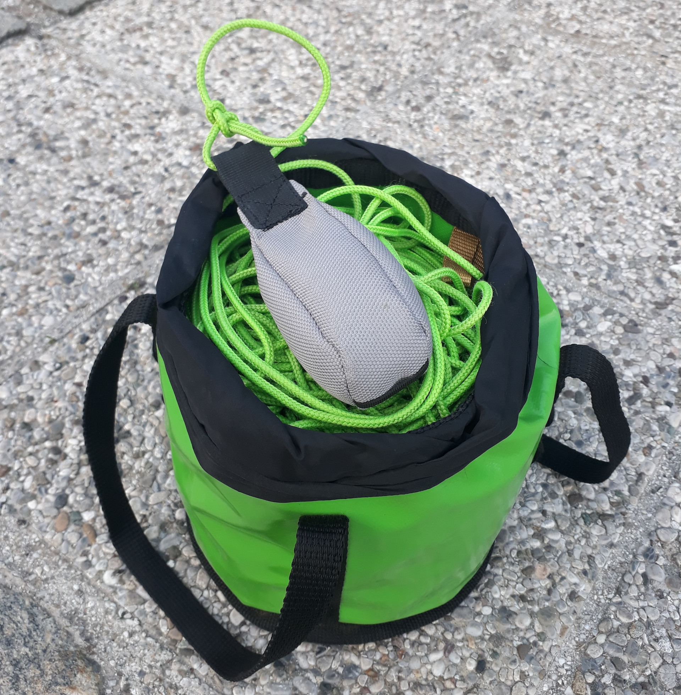

# Pilotna vrv

_Pilotna vrv_ (skrajšano tudi samo _pilotka_) je vrvica, s katero pri postavljanju [visokice](visokica) povlečemo trakova preko vrzeli. Navadno za pilotno vrv uporabljamo vrv debeline 3 ali 4 mm. Štirimilimetrska vrv je še zlasti priročna zato, ker je združljiva s prižemami ter drugimi napravami z zobci (na primer škripec Petzl Micro Traxion).

Pri [postavljanju](postavljanje) pilotno vrv prinesemo na [statično stran](staticna-stran), nato pa en konec spravimo nazaj na [napenjalno stran](napenjalna-stran). Pri krajših relacijah to storimo tako, da na vrv privežemo utež, ki jo nato zalučamo preko vrzeli. Če vrzel ni pregloboka in imamo dostop do njenega dna, je smiselna metoda tudi, da z vsake strani v globino vržemo po eno vrvico in nato spodaj njuna konca spojimo z vozlom. Pri večjih razdaljah pilotno vrv vzpostavimo v dveh stopnjah: preko vrzeli najprej spravimo tanjšo vrvico ali laks, nanj pa nato privežemo pilotno vrv in jo prevlečemo na drugo stran. Daljše razdalje zahtevajo tudi več napora in iznajdljivosti, da tanko vrvico ali laks v prvi stopnji sploh spravimo na drugo stran. Pri tem se poslužujemo pripomočkov, kot so frače, prače, ribiške palice ali loki, za zares dolge razdalje pa je najučinkovitejši prenos z dronom – če nam je ta možnost le na voljo.

Ko je pilotna vrv vzpostavljena, neposredno nanjo privežemo končni [zanki](sivana-zanka) [glavnega](glavni-trak) ter [pomožnega](pomozni-trak) traku. Pogosta napaka začetnikov je, da pilotno vrv namesto na zanki trakov privežejo na konec [popuščalke](popuscalka). Ker je v takšni vezavi popuščalka obremenjena, jo je na statični strani zelo težko vpeti v [sidrišče](sidrisce) oziroma je za vpetje potrebno neprijetno dodatno delo. Ekipa napenjalne strani, ki takšno napako zakuha, si zato ponavadi (upravičeno) prisluži nekaj karanja s strani ekipe statične strani, ki mora situacijo nato reševati. V pravilni vezavi je pilotna vrv speljana skozi obe končni zanki trakov, popuščalka pa je nameščena le na zanko glavnega traku in med vlečenjem ni obremenjena.

