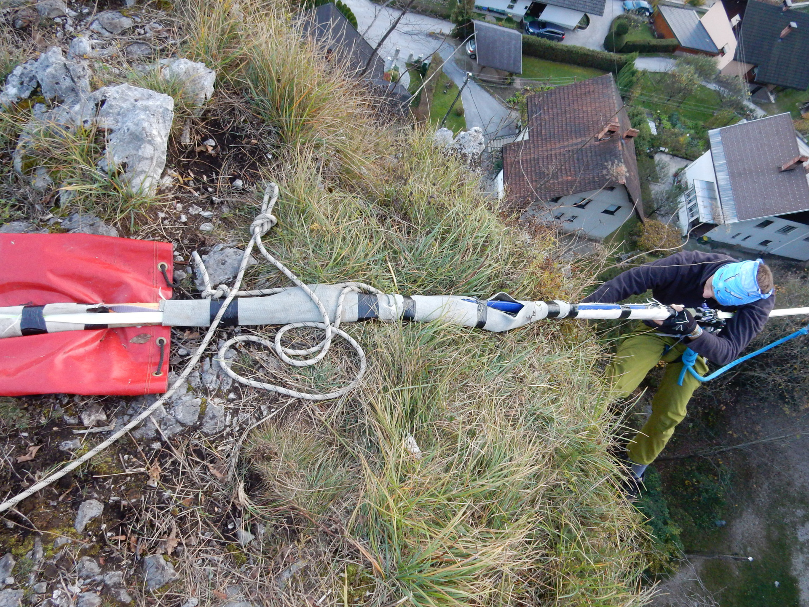

# Podloga

_Podloga_ so predmeti, s katerimi zaščitimo komponente sistema pred [abrazijo](abrazija). [Zanke](neskoncna-zanka) in vrvi obvarujemo pred drgnjenjem ob skale tako, da mesto drgnjenja podložimo z debelim kosom filca ali drugega blaga. V ta namen dobro služijo tudi razrezane odslužene gasilske cevi. Za podlaganje lahko uporabimo opremo, ki je trenutno ne potrebujemo, na primer zloženo vrečo, v kateri smo prinesli komponente za postavljanje [sidrišča](sidrisce). V primeru ostrih skalnih robov na krajišču [visokice](visokica) njuna [trakova](trak) zaščitimo z blazinami, nahrbtniki, ležalnimi podlogami ali kar na kup zmetanim neporabljenim preostankom trakov. Še bolje je, če poleg tega [skupno točko](skupna-tocka) sidrišča odmaknemo od tal z [A-okvirjem](a-okvir). V vseh primerih moramo zagotoviti, da se podloga ne bo sčasoma premaknila z mesta. Če je potrebno, jo pričvrstimo z vrvicami ali lepilnim trakom.

