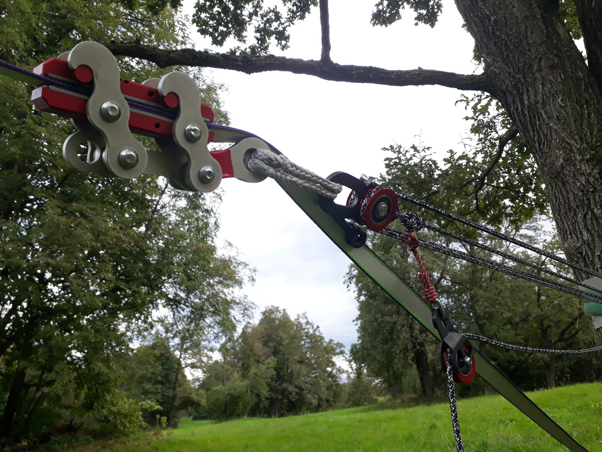

# Primež

_Primež_ je naprava, ki trdno zgrabi [trak](trak) in se uporablja za [napenjanje](napenjanje) [slacklinov](slackline). Najpomembnejša lastnost primeža je, da ga lahko namestimo na že napet trak in ga, ko silo nanj popustimo, s traku tudi preprosto odstranimo. Čeprav na videz opravlja podobno vlogo kot [banana](banana), ima primež precej drugačne lastnosti in namen, zato ni ustrezno nadomestilo zanjo.

## Princip delovanja

Osnova primeža sta dve vzporedni kovinski plošči, katerih stični ploskvi sta prevlečeni z gumo. Pri nameščanju primeža plošči razklenemo, z njima obdamo trak, nato pa namestimo nazaj ogrodje oziroma mehanizem primeža. Ko primež izpostavimo sili vzdolž traku, se plošči stisneta in zgrabita trak. Ko sila popusti, je mogoče plošči zopet razkleniti in primež odstraniti.

## Uporaba

Pri napenjanju traku primež namestimo pred [banano](banana) in nanj pripnemo [napenjalni sistem](napenjalni-sistem). Primež potisnemo kolikor je mogoče naprej po traku, nato pa pričnemo z napenjanjem. Pri uporabi vrvnih [škripcev](skripec) se trak med primežem in banano sprosti in ga moramo sproti ročno vleči v banano. To ni potrebno, če je banana sama del napenjalnega sistema (na primer v kombinaciji z [mačkom](macek)). Ko nam zmanjka hoda v napenjalnem sistemu ali ko pride primež preblizu banane, silo v napenjalnem sistemu popustimo in primež ponovno premaknemo naprej po traku. Postopek ponavljamo do želene [napetosti](napetost), nato pa primež odstranimo. Dokler je primež nameščen na trak, po njem ne smemo hoditi!

## Različice

Na tržišču je najti precej različic primežev. Izmed njih velja omeniti LineGrip, ki je najstarejša naprava te sorte in je bila nekaj časa kar sinonim za primež. Ta naprava ima kovinski mehanizem in prenese precejšnje sile, a je zato dokaj težka. Za njo so se na tržišču začele pojavljati manjše in lažje naprave za namensko uporabo na [visokicah](visokica), kjer so [napetosti](napetost) trakov občutno manjše, teža opreme pa pomembnejša. Pri tej generaciji primežev je kovinski mehanizem nadomeščen z močno vrvjo, ki je okoli plošč primeža opletena tako, da ju stisne, ko primež izpostavimo sili.

Primež si s pravimi materiali ter nekaj spretnosti in truda lahko izdelamo tudi sami. Na spletu so objavljena navodila za izdelavo primeža iz lesa (t.i. WoodGrip), najti pa je mogoče celo načrte za tiskanje primeža s 3D-tiskalnikom.

