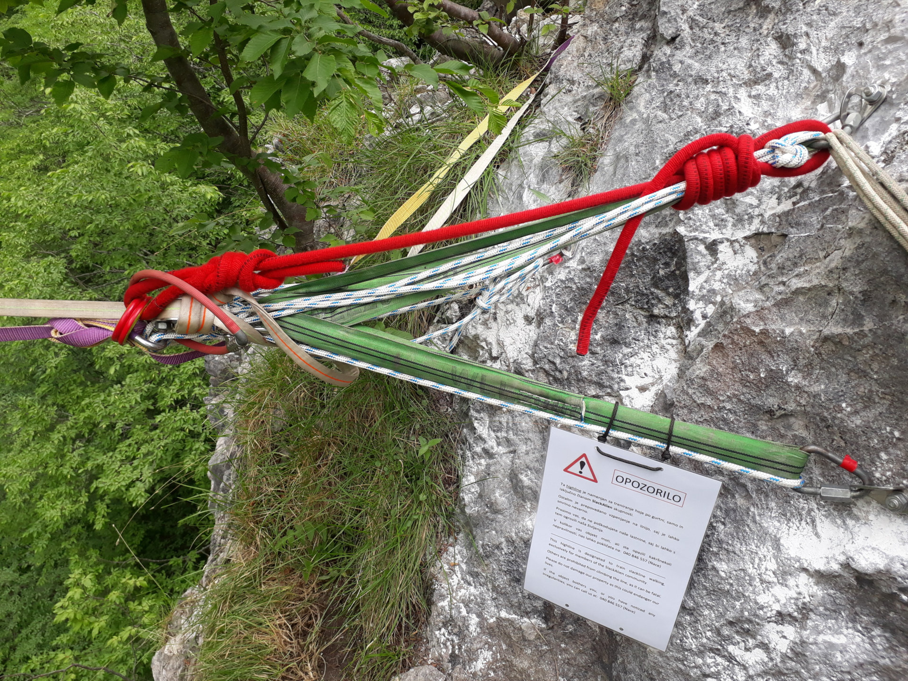

# Sidrišče

_Sidrišče_ je sistem veznih elementov, ki so na eni strani pripeti na okolico, na drugi strani pa se združijo v [skupni točki](skupna-tocka), v katero je vpet [slackline](slackline). Izdelava sidrišč je prvi korak pri [postavljanju](postavljanje). Sidrišča se v grobem ločijo na dve vrsti glede na način pritrditve: izdelamo jih lahko bodisi z ovijanjem celih objektov z [zankami](neskoncna-zanka) ali vrvmi bodisi z izkoriščanjem sidriščnih točk, ki so na objekte pritrjene. Najpogostejši primer ovijanja je sidranje na drevesa, sidranje v pritrjene točke pa se uporablja pri skalnih sidriščih. [Trak](trak) je v skupno točko sidrišča vpet z [banano](banana) ali [šivano zanko](sivana-zanka). Vezne elemente sidrišča je treba ustrezno zaščititi pred [abrazijo](abrazija), pri [visokicah](visokica) pa je treba poskrbeti tudi za [redundanco](redundanca).

## Sidrišča na drevesih

Sidranje na drevesa je najpogostejši način pritrjevanja slacklinov. Za postavljanje takega sidrišča navadno uporabimo [tovorno](tovorna-zanka) ali drugo [neskončno zanko](neskoncna-zanka), ki jo ovijemo okoli drevesa. Uporabiti je mogoče tudi statično vrv, a je ta izbira manj priporočljiva, saj vrv močneje pritiska na skorjo drevesa kot ploščati trak zanke. V vseh primerih je treba drevo pred drgnjenjem zaščititi s [podlogo](podloga). Zanko lahko na drevo namestimo v konfiguraciji koša (ovijemo jo okoli drevesa in združimo konca) ali pa jo nanj zavežemo s [kavbojskim vozlom](kavbojski-vozel). Zanka v konfiguraciji koša ima večjo nosilnost, a tudi slabo lastnost, da neobremenjena med postavljanjem zdrsava navzdol po deblu. Zdrsavanje lahko preprečimo tako, da jo pripnemo na podlogo, s katero smo zaščitili drevo (na primer z uporabo trakcev z "ježkom"). Kavbojski vozel trdno objame drevo in s tem že sam prepreči zdrsavanje, a je njegova nosilnost nekoliko manjša, poleg tega pa se prosti konec zanke lahko suka in se moramo zato nekoliko potruditi, če želimo slackline vpeti vodoravno. V obeh konfiguracijah na zanko v [skupni točki](skupna-tocka) namestimo [škopec](skopec), nanj pa bodisi [banano](banana) ali neposredno [šivano zanko](sivana-zanka) traku.

Pri sidranju [visokice](visokica) je treba drevo pazljivo izbrati: biti mora dovolj močno in stabilno, da ga sile pri uporabi visokice ne morejo podreti. Če imamo kakršnekoli dvome v stabilnost sicer dovolj močnega drevesa, drevo dodatno zavarujemo tako, da ga z vrvmi privežemo na druga drevesa za njim. Če se primarno drevo začne nagibati, vrvi prenesejo del obremenitve na sekundarna drevesa in s tem obvarujejo primarno drevo pred podrtjem. Varovalne vrvi moramo čim bolj napeti, da v primeru nagiba drevesa takoj začnejo prenašati silo naprej. Zaščita s privezovanjem primarnega drevesa na sekundarna je edina, ki je v takšnih okoliščinah dovolj varna: _nikakor_ ne smemo situacije reševati tako, da [pomožni trak](pomozni-trak) ali neobremenjena repa [glavnega](glavni-trak) in pomožnega traku privežemo na drugo drevo. Samo primarno drevo namreč tako ostane nezavarovano in če se podre, lahko s svojo težo preobremeni tudi varnostno povezavo ter privede do [verižne odpovedi](verizna-odpoved).

Če imamo namesto enega močnega drevesa na voljo le več šibkejših, lahko sidrišče izdelamo tako, da do vsakega od njih speljemo svoj niz zank ali vrv, njihova krajišča pa združimo v [skupni točki](skupna-tocka). Pri tem moramo nujno poskrbeti, da se sila iz skupne točke enakomerno porazdeli med drevesa.

## Sidrišča v skali

Skalna sidrišča lahko v nekaterih primerih izvedemo z ovijanjem, in v tem primeru veljajo podobna pravila kot pri izdelavi sidrišč na drevesu. Kadar skala ni primerno oblikovana za ovijanje, pa se moramo poslužiti pritrjevanja s skalnimi vijaki. Že pri zasnovi sidrišča je treba razmišljati o [redundanci](redundanca): v skalo običajno namestimo dva do tri vijake. Nanje privijemo kovinska ušesa, skozi slednja pa vstavimo bodisi [deltaste člene](deltasti-clen) (za uporabo s [tovornimi zankami](tovorna-zanka)) bodisi [ovalne člene](ovalni-clen) (za sidrišča s statičnimi vrvmi). Pramene zank ali vrvi zberemo v [skupni točki](skupna-tocka), kjer skoznje vstavimo kovinski vezni člen, na primer [škopec](skopec). Pri uporabi vrvi lahko pred tem vse pramene še zavežemo v [jebeno velik vozel](jebeno-velik-vozel).
