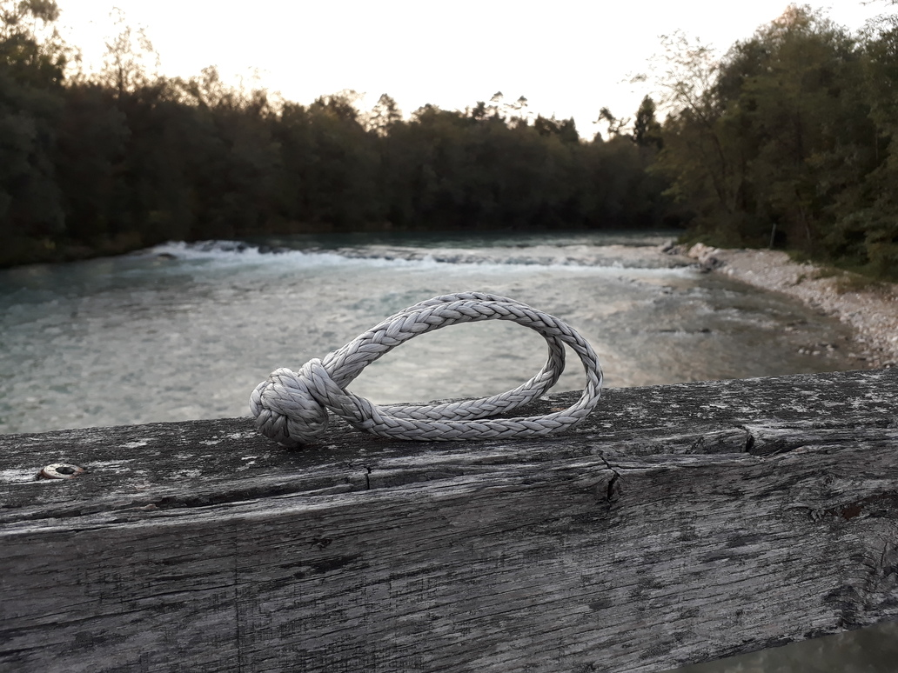

# Vrvni škopec

_Vrvni škopec_ je vezni člen, ki ima podobne lastnosti kot [škopec](skopec), vendar je za razliko od slednjega izdelan iz vrvi in zato gibek. Za vrvne škopce se uporablja ohlapno pletena vrv iz [UHMWPE](https://en.wikipedia.org/wiki/UHMWPE) (bolj poznana pod blagovnim imenom Dyneema). Na eni strani škopca je vrv vdeta sama skozi sebe, s čimer oblikuje kratko zanko, na drugi strani pa sta konca vrvi spletena v debel vozel. Škopec zapremo tako, da vozel vstavimo skozi zanko, ki se že ob najmanjši obremenitvi zadrgne in prepreči, da bi vozel zdrsel nazaj skoznjo.

Glavna prednost vrvnega škopca pred kovinskim je, da je mnogo lažji in ga je zato lažje prenašati. Poleg tega predstavlja manjšo nevarnost v primeru, da ob odpovedi kakega drugega veznega člena z veliko hitrostjo odleti v človeka. Glavni pomanjkljivosti sta neodpornost na abrazijo (preko vrvnega škopca _nikoli_ ne smemo vleči vrvi ali trakov) ter načelna možnost, da se neobremenjen vrvni škopec sam odpre, če je izpostavljen tresljajem. V praksi so vrvni škopci vedno podvrženi vsaj majhni obremenitvi, zato do odprtja ne pride; za vsak slučaj pa v primeru dvoma njihovo zanko vseeno ovijemo še z lepilnim trakom.

Ob prvem srečanju z vrvnim škopcem večina ljudi sumničavo privzdigne obrv, saj podoba prepletene vrvi na prvi pogled ne vliva enakega zaupanja kot podoba bolj poznanih kovinskih veznih členov. A ob upoštevanju specifičnih zahtev vrvnega škopca (zaščita pred abrazijo ter uporaba v situacijah, kjer je vedno podvržen vsaj majhni obremenitvi) je strah odveč. Material, iz katerega so vrvni škopci izdelani, je namreč skoraj nepredstavljivo močan: vrvni škopec iz 5-milimetrske vrvi ima [najmanjšo porušno silo](najmanjsa-porusna-sila) okoli 40 kN, kar je primerljivo s kovinskim škopcem debeline 10 mm. Vrvni škopec iz 6-milimetrske vrvi pa se poruši pri sili okoli 60 kN, kar je primerljivo s kovinskim škopcem debeline 12 mm.

Vrvni škopec je v visokovanju še zlasti nepogrešljiv pri sestavljanju [segmentiranih](segmentiranje) trakov. V ta namen se uporabljajo vrvni škopci iz 5-milimetrske vrvi, ki so zelo kompaktni, obenem pa znatno močnejši od večine [trakov](trak).
