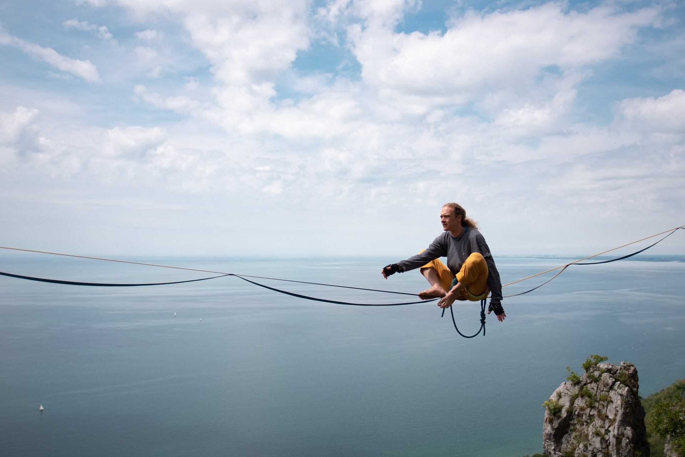

# Vstajanje

_Vstajanje_ na trak iz sedečega položaja in brez pomoči tal je ena od osnovnih veščin, ki so potrebne za hojo po [visokici](visokica). Spodaj so opisani trije najpogosteje uporabljani načini. Pri vseh načinih pričnemo tako, da sedimo okobal na traku. Trak naj bo malenkost odmaknjen na eno stran, saj sicer pritisne naravnost na trtico, kar je precej boleče in neudobno. Z poskušanjem se ga hitro naučimo namestiti na mišice ob sedalni kosti, ki tak pritisk dobro prenašajo.

## Vstajanje iz sedé

Vstajanje iz sede velja za "zlati standard". Ker je treba prehod v čepeči položaj izvesti hitro, ta način vstajanja sicer ni najlažji, a se z njim izognemo nekaterim slabim lastnostim drugih načinov. Zato ga vseeno priporočamo kot prvo izbiro pri učenju.

Stopali najprej položimo na trak pred seboj. Stopalo, ki je bliže telesu, zasukamo vstran in navzdol – trak poteka počez pod stopalom, blizu pete. Drugo stopalo postavimo pred prvo in ga poravnamo s smerjo traku. Obe stopali sta kar se da blizu telesu, saj to olajša vstajanje. Koleni razmaknemo, da si naredimo prostor, roke držimo razširjene, kot pri hoji po traku. Sedaj trup nagnemo naprej. Za nekatere ljudi je to že kar dovolj, da prenesejo težo na stopala. Če samo nagib ne zadostuje, si pomagamo z roko, in sicer se bodisi z njo odrinemo od traku za sabo bodisi se potegnemo za trak pred seboj. V obeh primerih naj bo stik roke s trakom čim krajši, saj ta položaj precej zmanjša možnosti za lovljenje ravnotežja. Po prenosu teže na stopala lahko za hip obmirujemo v čepečem položaju: ker je težišče telesa še vedno zelo blizu traku, je tak položaj precej stabilen in ga lahko izkoristimo za umiritev traku ter poravnavo telesa pred vstajanjem. Lahko pa prenos teže in vstajanje izvedemo tudi kot en sam zvezen gib.

## Vstajanje s spuščenim kolenom

Vstajanje s spuščenim kolenom je nekoliko podobno vstajanju na Chongo in nudi podobno stabilnost, vendar v primerjavi s slednjim bistveno manj obremeni koleno. Njegova slaba stran je, da se je ob težavah težko izviti iz položaja, zato je padec pri spodletelem poskusu vstajanja manj nadzorovan, kar dela ta način manj primeren za vadbo v parku. V odsotnosti bližine tal ta lastnost ni tako problematična, zato je na visokicah ta način vstajanja precej pogostejši.

Da dosežemo izhodiščni položaj za to vrsto vstajanja, se najprej nagnemo močno naprej in eno od stopal z nartom navzdol naslonimo na trak za seboj. Nato se vzravnamo in pomaknemo nazaj po traku, dokler ne obsedimo na stopalu. Ker v tem položaju trak močno pritiska na nart, je lahko prvih nekaj poskusov precej bolečih, a z nekaj vaje se naučimo obremeniti pravo mesto in pritisku traku komaj še posvečamo kaj pozornosti. Roko, ki je na isti strani telesa kot stopalo, na katerem sedimo, iztegnemo vstran kot pri hoji, nasprotno roko pa prislonimo na trak tik pred seboj in si z njo pomagamo k vzravnani drži. Sedaj drugo nogo dvignemo predse in jo položimo na trak. V trenutku, ko to storimo, z roko izpustimo trak in pričnemo loviti ravnotežje z obema rokama. Ta položaj je zelo stabilen in lahko v njem nekaj časa počakamo. Nato pričnemo z vstajanjem, pri katerem večji delež dela opravi prednja noga. Ko smo opravili približno dve tretjini vstajanja, večino teže prenesemo na prednjo nogo, zadnje stopalo hitro obrnemo v pokončen položaj, z njim stopimo nazaj na trak ter v tem položaju dokončamo vstajanje

## Vstajanje na Chongo

Ta tehnika vstajanja je zelo stabilna in se je je enostavno naučiti, jo pa vseeno omenjamo zadnjo, ker je bilo ugotovljeno, da pri mnogih ljudeh preobremeni koleno in sčasoma privede do bolečin ter poškodb. Priporočamo previdnost.

V izhodiščni položaj za vstajanje na Chongo pridemo tako, da se nagnemo močno naprej in eno od stopal položimo na trak za seboj. Nato se vzravnamo in hkrati pomikamo po traku nazaj, dokler ne obsedimo na svoji peti. Stopalo pod nami je pri tem usmerjeno navzdol ter zasukano skoraj pravokotno glede na smer vstajanja, trak pa poteka počez po stopalu, tik pred peto. Roko, ki je na isti strani telesa kot stopalo, na katerem sedimo, iztegnemo vstran kot pri hoji, nasprotno roko pa prislonimo na trak tik pred seboj in si z njo pomagamo k vzravnani drži. V tem položaju se razkrije, ali je tehnika vstajanja na Chongo sploh primerna za nas. Teža zgornjega dela telesa se mora na peto prenašati _izključno_ preko stika s sedalno kostjo. Če je med peto in zadnjico že _samo najmanjša špranja_, se znaten delež sile prenese preko kolena, kar na dolgi rok privede do poškodb sklepa. V primeru, da lahko stabilno sedemo na peto, nadaljujemo: drugo nogo dvignemo predse in jo položimo na trak. V trenutku, ko to storimo, z roko izpustimo trak in pričnemo loviti ravnotežje z obema rokama. Telo pomaknemo naprej, da razporedimo težo po obeh nogah, nato pa počasi vstanemo.
