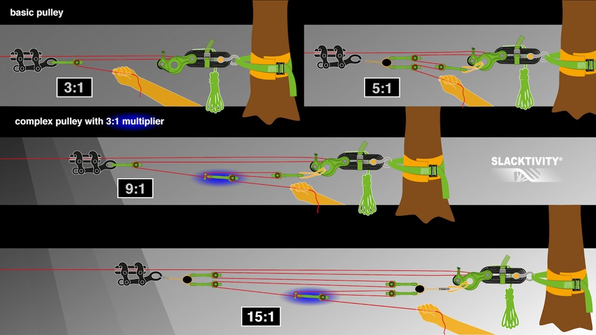
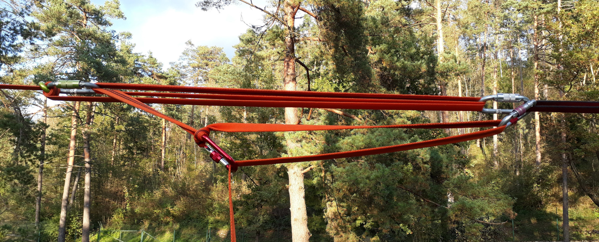

# Napenjalni sistem

_Napenjalni sistem_ je skupek komponent, s katerim [napenjamo](/napenjanje)
[trak](/trak). Vsem je skupno, da z njimi ustvarimo
[mehansko prednost](/mehanska-prednost). Poznamo več osnovnih sistemov:

## Buckinghamski sistem

Je največkrat uporabljen pri napenjanju visokic. Zanj potrebujemo le malo
komponent: za osnoven sistem z mehansko prednostjo 3:1 sta potrebna le
[primež](/primez) in [maček](/macek), kot del napenjalnega sistema pa deluje
tudi [banana](/banana), ki po koncu napenjanja ostane na svojem mestu. Pri
večini visokic že samo s takim sistemom dosežemo dovoljšnjo
[napetost](/napetost) za hojo. Višje sile je moč doseči tako, da trak povleče
več ljudi; če to ne zadostuje, pa dodajamo [množilnike](/mnozilnik).

## Primitivni sistem

Je enostaven sistem, največkrat uporabljen pri napenjanju krajših trakov v parku
(njegova uporaba je smiselna do dolžine približno 30 m). Zanj potrebujemo več
[vponk](/vponka) in linelocker. Ustvarimo ga tako, da trak za linelockerjem
peljemo v več ovojih skozi vponki na linelockerju in [sidrišču](/sidrisce), pri
čemer vsak nov ovoj postavimo pod prejšnjega. S takšnim ovijanjem dosežemo
pomnožitev sile, hkrati pa ustvarimo zadostno trenje, da trak, ko ga enkrat
napnemo, ne more popustiti sam od sebe. Tudi tu je za večjo mehansko prednost
moč dodati množilnike, ki jih izdelamo z dodatnimi vponkami.

## Škripčevje

Je bolj kompleksen sistem, sestavljen iz več [škripcev](/skripec), vrvi in
zavore. Uporablja se za napenjanje dolgih linij oziroma linij, ki potrebujejo
višje [napetosti](/napetost).

