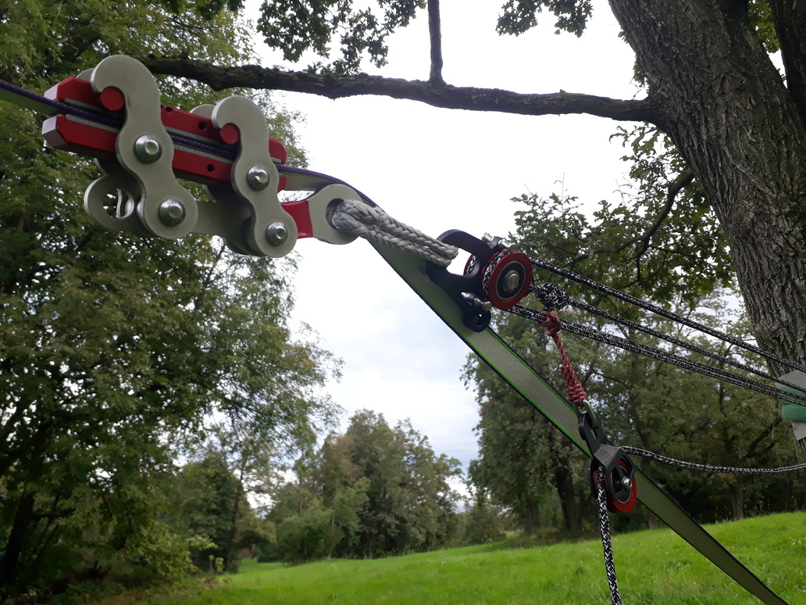

# Primež

_Primež_ je naprava, ki trdno zgrabi [trak](/trak) in se uporablja za
[napenjanje](/napenjanje) [slacklinov](/slackline). Najpomembnejša lastnost
primeza je, da ga lahko namestimo na že napet trak in ga, ko silo nanj
popustimo, s traku tudi preprosto odstranimo. Čeprav na videz opravlja podobno
vlogo kot [banana](/banana), ima primez precej drugačne lastnosti in namen, zato
ni ustrezno nadomestilo zanjo.

## Princip delovanja

Osnova primeza sta dve vzporedni kovinski plošči, katerih stični ploskvi sta
prevlečeni z gumo. Pri nameščanju primeza plošči razklenemo, z njima obdamo
trak, nato pa namestimo nazaj ogrodje oziroma mehanizem primeza. Ko primez
izpostavimo sili vzdolž traku, se plošči stisneta in zgrabita trak. Ko sila
popusti, je mogoče plošči zopet razkleniti in primez odstraniti.

## Uporaba

Pri napenjanju traku primez namestimo pred [banano](/banana) in nanj pripnemo
[napenjalni sistem](/napenjalni-sistem). Primež potisnemo kolikor je mogoče
naprej po traku, nato pa pričnemo z napenjanjem. Pri uporabi vrvnih
[škripcev](/skripec) se trak med primezem in banano sprosti in ga moramo sproti
ročno vleči v banano. To ni potrebno, če je banana sama del napenjalnega sistema
(na primer v kombinaciji z [mačkom](/macek)). Ko nam zmanjka hoda v napenjalnem
sistemu ali ko pride primez preblizu banane, silo v napenjalnem sistemu
popustimo in primez ponovno premaknemo naprej po traku. Postopek ponavljamo do
želene [napetosti](/napetost), nato pa primez odstranimo. Dokler je primež
nameščen na trak, po njem ne smemo hoditi!

## Različice

Na tržišču je najti precej različic primezev. Izmed njih velja omeniti LineGrip,
ki je najstarejša naprava te sorte in je bila nekaj časa kar sinonim za primez.
Ta naprava ima kovinski mehanizem in prenese precejšnje sile, a je zato dokaj
težka. Za njo so se na tržišču začele pojavljati manjše in lažje naprave za
namensko uporabo na [visokicah](/visokica), kjer so [napetosti](/napetost)
trakov občutno manjše, teža opreme pa pomembnejša. Pri tej generaciji primezev
je kovinski mehanizem nadomeščen z močno vrvjo, ki je okoli plošč primeza
opletena tako, da ju stisne, ko primez izpostavimo sili.

Primež si s pravimi materiali ter nekaj spretnosti in truda lahko izdelamo tudi
sami. Na spletu so objavljena navodila za izdelavo primeza iz lesa (t.i.
WoodGrip), najti pa je mogoče celo načrte za tiskanje primeza s 3D-tiskalnikom.

