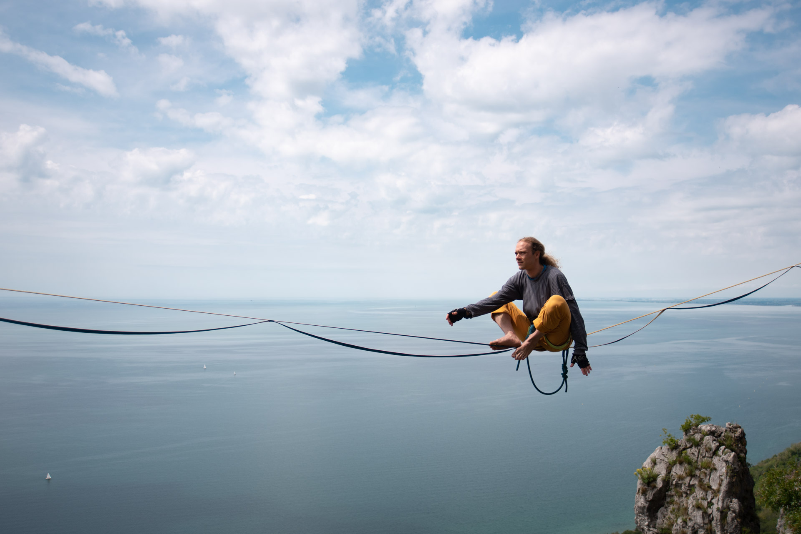

# Vstajanje

_Vstajanje_ na trak iz sedečega položaja in brez pomoči tal je ena od osnovnih
veščin, ki so potrebne za hojo po [visokici](/visokica). Spodaj so opisani trije
najpogosteje uporabljani načini. Pri vseh načinih pričnemo tako, da sedimo
okobal na traku. Trak naj bo malenkost odmaknjen na eno stran, saj sicer
pritisne naravnost na trtico, kar je precej boleče in neudobno. Z poskušanjem se
ga hitro naučimo namestiti na mišice ob sedalni kosti, ki tak pritisk dobro
prenašajo.

## Vstajanje iz sedé

Vstajanje iz sede velja za "zlati standard". Ker je treba prehod v čepeči
položaj izvesti hitro, ta način vstajanja sicer ni najlažji, a se z njim
izognemo nekaterim slabim lastnostim drugih načinov. Zato ga vseeno priporočamo
kot prvo izbiro pri učenju.

Stopali najprej položimo na trak pred seboj. Stopalo, ki je bliže telesu,
zasukamo vstran in navzdol - trak poteka počez pod stopalom, blizu pete. Drugo
stopalo postavimo pred prvo in ga poravnamo s smerjo traku. Obe stopali sta kar
se da blizu telesu, saj to olajša vstajanje. Koleni razmaknemo, da si naredimo
prostor, roke držimo razširjene, kot pri hoji po traku. Sedaj trup nagnemo
naprej. Za nekatere ljudi je to že kar dovolj, da prenesejo težo na stopala. Če
samo nagib ne zadostuje, si pomagamo z roko, in sicer se bodisi z njo odrinemo
od traku za sabo bodisi se potegnemo za trak pred seboj. V obeh primerih naj bo
stik roke s trakom čim krajši, saj ta položaj precej zmanjša možnosti za
lovljenje ravnotežja. Po prenosu teže na stopala lahko za hip obmirujemo v
čepečem položaju: ker je težišče telesa še vedno zelo blizu traku, je tak
položaj precej stabilen in ga lahko izkoristimo za umiritev traku ter poravnavo
telesa pred vstajanjem. Lahko pa prenos teže in vstajanje izvedemo tudi kot en
sam zvezen gib.

## Vstajanje s spuščenim kolenom

Vstajanje s spuščenim kolenom je nekoliko podobno vstajanju na Chongo in nudi
podobno stabilnost, vendar v primerjavi s slednjim bistveno manj obremeni
koleno. Njegova slaba stran je, da se je ob težavah težko izviti iz položaja,
zato je padec pri spodletelem poskusu vstajanja manj nadzorovan, kar dela ta
način manj primeren za vadbo v parku. V odsotnosti bližine tal ta lastnost ni
tako problematična, zato je na visokicah ta način vstajanja precej pogostejši.

Da dosežemo izhodiščni položaj za to vrsto vstajanja, se najprej nagnemo močno
naprej in eno od stopal z nartom navzdol naslonimo na trak za seboj. Nato se
vzravnamo in pomaknemo nazaj po traku, dokler ne obsedimo na stopalu. Ker v tem
položaju trak močno pritiska na nart, je lahko prvih nekaj poskusov precej
bolečih, a z nekaj vaje se naučimo obremeniti pravo mesto in pritisku traku
komaj še posvečamo kaj pozornosti. Roko, ki je na isti strani telesa kot
stopalo, na katerem sedimo, iztegnemo vstran kot pri hoji, nasprotno roko pa
prislonimo na trak tik pred seboj in si z njo pomagamo k vzravnani drži. Sedaj
drugo nogo dvignemo predse in jo položimo na trak. V trenutku, ko to storimo, z
roko izpustimo trak in pričnemo loviti ravnotežje z obema rokama. Ta položaj je
zelo stabilen in lahko v njem nekaj časa počakamo. Nato pričnemo z vstajanjem,
pri katerem večji delež dela opravi prednja noga. Ko smo opravili približno dve
tretjini vstajanja, večino teže prenesemo na prednjo nogo, zadnje stopalo hitro
obrnemo v pokončen položaj, z njim stopimo nazaj na trak ter v tem položaju
dokončamo vstajanje

## Vstajanje na Chongo

Ta tehnika vstajanja je zelo stabilna in se je je enostavno naučiti, jo pa
vseeno omenjamo zadnjo, ker je bilo ugotovljeno, da pri mnogih ljudeh
preobremeni koleno in sčasoma privede do bolečin ter poškodb. Priporočamo
previdnost.

V izhodiščni položaj za vstajanje na Chongo pridemo tako, da se nagnemo močno
naprej in eno od stopal položimo na trak za seboj. Nato se vzravnavamo in hkrati
pomikamo po traku nazaj, dokler ne obsedimo na svoji peti. Stopalo pod nami je
pri tem usmerjeno navzdol ter zasukano skoraj pravokotno glede na smer
vstajanja, trak pa poteka počez po stopalu, tik pred peto. Roko, ki je na isti
strani telesa kot stopalo, na katerem sedimo, iztegnemo vstran kot pri hoji,
nasprotno roko pa prislonimo na trak tik pred seboj in si z njo pomagamo k
vzravnani drži. V tem položaju se razkrije, ali je tehnika vstajanja na Chongo
sploh primerna za nas. Teža zgornjega dela telesa se mora na peto prenašati
_izključno_ preko stika s sedalno kostjo. Če je med peto in zadnjico že _samo
najmanjša špranja_, se znaten delež sile prenese preko kolena, kar na dolgi rok
privede do poškodb sklepa. V primeru, da lahko stabilno sedemo na peto,
nadaljujemo: drugo nogo dvignemo predse in jo položimo na trak. V trenutku, ko
to storimo, z roko izpustimo trak in pričnemo loviti ravnotežje z obema rokama.
Telo pomaknemo naprej, da razporedimo težo po obeh nogah, nato pa počasi
vstanemo.
